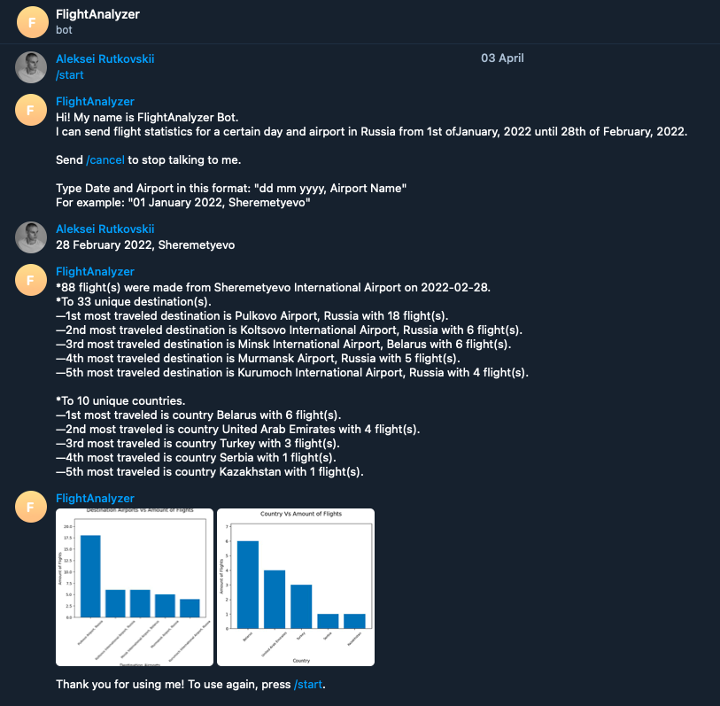
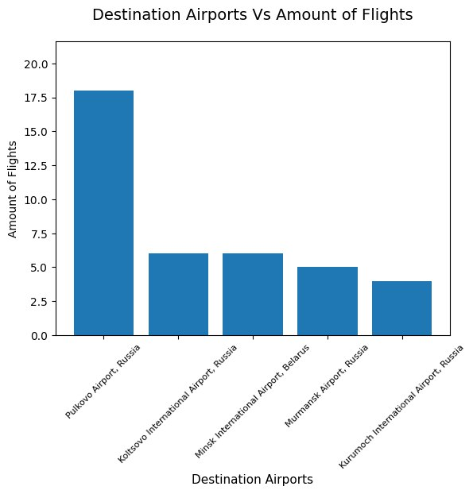
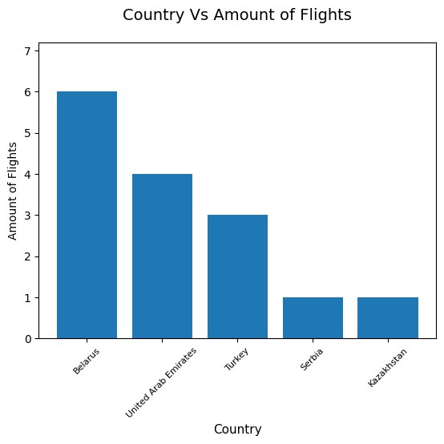

# Russian Airport FlightAnalysis

My intent with ths project was to hone my pandas skills, learn basic web scraping, and practice regex.

## What Can It Do?

A person types "Date, Russian Airport" to receive flight statistics from this airport for this specific date from \
__January 1,2022 until February 22,2022__.

  

    
  

  

    
  

  

    
  

## Main Files

`main.py` and `RusAirtraffic.ipynb` are two main files that can be used to extract the statistics.

`main.py` is a source code for a Telegram Bot that provides the person a minimal interface.

`RusAirtraffic.ipynb` is a Google Colaboratory notebook that I used to webscrape, clean, and output data for bot's usage\
(`static/all_flights.csv`,`static/international_airports.csv`,`static/russian_airports.csv`).

In `static` directory all csvs are located.
`flightlist_20220101_20220131.csv.gz` and `flightlist_20220201_20220228.csv.gz` contain entire world flight data from\
January and February 2022.

## Deployment

To run Telegram Bot, I use Heroku.

## Sources
1. https://zenodo.org/record/6325961#.YkHzUzdBxQI
2. https://en.wikipedia.org/wiki/List_of_international_airports_by_country
3. https://en.wikipedia.org/wiki/List_of_airports_in_Russia"
4. http://www.flugzeuginfo.net/table_airportcodes_country-location_en.php

## Neglections and What Can Be Better

### Neglections

1. Neglected flights that are flying out and returning to the same airport (but it sounds reasonable to do)
2. There a more destination airports than what I have parsed, therefore I needed to not include airports for which I did not have name and country when plotting.

### Improvements that can be done
1. Correct Pt.2 of Neglections to additional parsing of data
2. Add more flight data from https://zenodo.org/record/6325961#.YkHzUzdBxQI
3. Deploy on the web using Flask 
4. Y-axis have containing integers

Date of first edit: 04/09/2022
Date of last edit: 04/09/2022